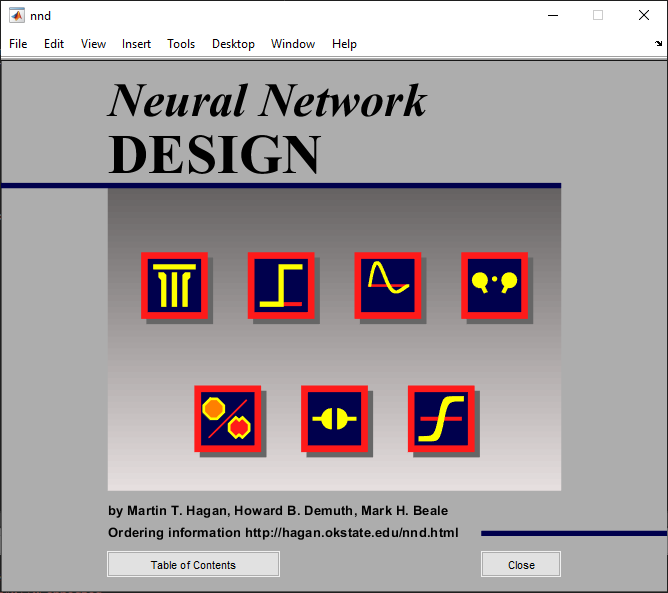

# Examples for Neural Network Design 
[](https://www.mathworks.com/matlabcentral/fileexchange/####-file-exchange-title)  
<!-- Add this icon to the README if this repo also appears on File Exchange via the "Connect to GitHub" feature --> 

Learn about fundamental concepts of neural network design with the Neural Network Design app. For more information see [Neural Network Design](https://hagan.okstate.edu/NNDesign.pdf).

## Requirements

This repository requires:
- [MATLAB](https://www.mathworks.com/products/matlab.html) (R2019b or newer)
- [Deep Learning Toolbox&trade;](https://www.mathworks.com/products/deep-learning.html)

## Setup 
To open the app, run:

```matlab
>> nnd
```
Click **Table of Contents** to see the available selection of examples.



## License

The license is available in the License.txt file in this GitHub repository.

## Community Support
[MATLAB Central](https://www.mathworks.com/matlabcentral)

Copyright 1997-2023 The MathWorks, Inc.